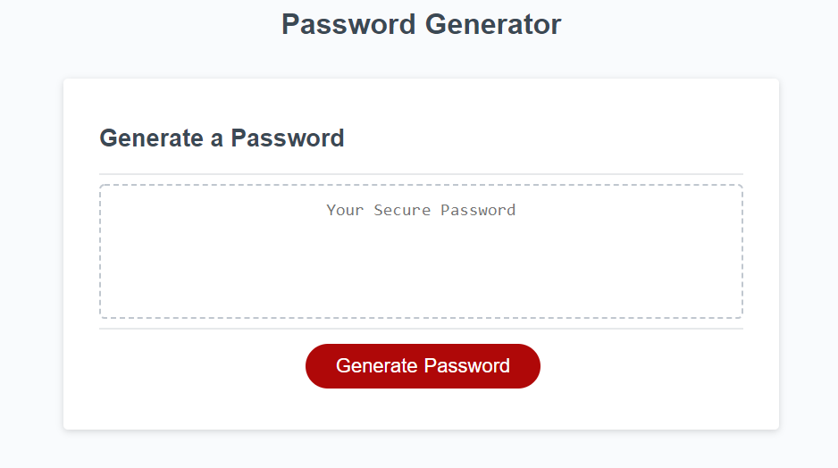
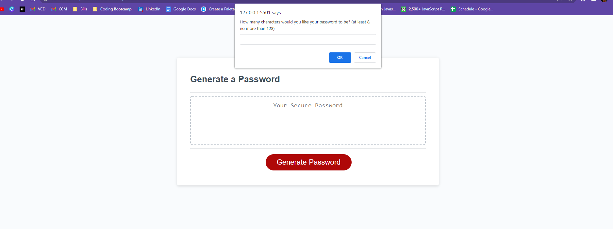

# Password Generator!

This page generates a random password after a series of promopts are answered. 

* First prompt asks the user to select a number betweenm 8 and 128. If the number they choose is not within these reqirements, the code will break and return them to answer the prompt correctly. 

* Next they are prompted with yes/no questions of whether they want lowercase letters, uppercase letters, numbers or special characters in their password. The user has to say yes to at least one or the code will break and have them go back to answer the prompt properly.

* Lastly, the page will take the user input and generate a random password. 

